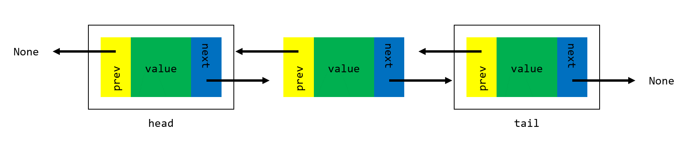

# Project 1: Doubly Linked Lists

**Due: Friday, January 29th @ 11:59p ET**

*This is not a team project. Do not copy someone else’s work.*

## Assignment Overview

Doubly linked lists (DLLs) are a fundamental data structure used to store sequential information.
DLLs consist of a chain of *nodes* linked to one another by *forward* and *backward* references,
such that one may traverse the chain from the *head* to the *tail*, or vice-versa. Each node
stores a *value*, which may be a number, string, or more complex object.

Traditional *arrays* provide a simpler means for storing sequential information, but come with
a major drawback which DLLs avoid: arrays require contiguous blocks of memory, while DLLs may utilize
memory wherever it is available. In settings where data is updated, manipulated or deleted frequently,
DLLs outperform traditional arrays by avoiding the need for memory reallocation.
[This article](https://www.geeksforgeeks.org/linked-list-vs-array/) gives a nice overview of the
distinction between DLLs and arrays.

In this project,
you will be implementing a DLL from scratch in Python and applying it to solve a stock investment
optimization problem. 

## Assignment Notes

1. Time and space complexity are not graded on Project 1. However, we encourage you to try to implement
your code according to the suggested complexities in each function!
1. To evaluate your code's running time, utilize the `test_cProfile` function in the `tests.py` file.
This will be a powerful tool for you to utilize throughout CSE 331 and beyond when runtime is of the essence.
More information is available in the [official Python documentation](https://docs.python.org/3/library/profile.html).
1. Testcases are your friend: before asking about what the form of input/output is or what happens in a
particular edge case, check to see if the testcases answer your question for you. By showing the
expected output in response to each input, they supplement the specs provided here.
1. Don't be afraid to [step through your code in the debugger](https://mediaspace.msu.edu/media/Merge_Sort+Recursive+Work+using+Debugger/1_h0i8pvg2): it will help you figure out where
you're going wrong far more quickly than ad-hoc print statements!
1. Throughout the specs, we mention Python double-underscore "magic" methods. These are central to the
structure of object-oriented programming in Python, and will continue to appear in future projects in CSE 331 and beyond.
[This page](https://rszalski.github.io/magicmethods/) is a great reference if you'd like to learn more about how they work!
1. We **strongly** encourage you to avoid calling `delete` in `delete_all`. Why? It's
far less efficient to repeatedly call `delete`, as each call to `delete` begins searching
at the beginning of the list. In the worst case, this will lead our function to operate
with *quadratic* time complexity. Can you make `delete_all` operate more efficiently
by examining each element in the DLL once in a linear fashion?
1. We **strongly** encourage you to implement `reverse` in-place, without creating any
new `Node` objects and instead rearranging `prev` and `next` pointers. Why?
It's far less efficient to rebuild the DLL than it is to simply adjust references, as it's
far more work to construct a brand new `Node` object than it is to simply adjust an existing one's references!
1. In the testcases for this project, you will notice the use of `assertEqual` and `assertIs`.
What's the difference? It ties back to the difference between `==` and `is` in Python.
The double-equal sign compares *values* in Python, while the `is` operator compares *memory addresses*
in Python. Put simply, the `is` keyword is stronger than `==`: if two objects are at the
same memory address, they must contain the same value. However, it is possible for two
objects *not* at the same memory address to have the same value. In other words,
if `a is b` then we know `a == b` as well, but if `a == b` we cannot conclude `a is b`.
A great read on the subject is [available here](https://realpython.com/courses/python-is-identity-vs-equality/).

## Assignment Specifications

#### class Node:

*DO NOT MODIFY the following attributes/functions*

- **Attributes**
  - **value: T:** Value held by the `Node`. Note that this may be any type, such as a `str`, `int`,
  `float`, `dict`, or a more complex object.
  - **next: Node:** Reference to the next `Node` in the linked list (may be `None`).
  - **prev: Node:** Reference to the previous `Node` in the linked list (may be `None`).
- **\_\_init\_\_(self, value: T, next: Node = None, prev: Node = None) -> None**
  - Constructs a doubly linked list node.
  - **value: T:** Value held by the `Node`.
  - **next: Node:** Reference to the next `Node` in the linked list (may be `None`).
  - **prev: Node:** Reference to the previous `Node` in the linked list (may be `None`).
  - **Returns:** `None`.
- **\_\_str\_\_(self) -> str** and **\_\_repr\_\_(self) -> str**
  - Represents the `Node` as a string.
  - Note that Python will automatically invoke this function when using printing a `Node`
    to the console, and PyCharm will automatically invoke this function when displaying a
    `Node` in the debugger.
  - As with all double-underscore "magic" methods in Python (see note 5), this function may be called
    with `str(node)` or `repr(node)`. It is not necessary (and stylistically improper)
    to use `node.__str__()` or `node.__repr__()`, just as it is preferable to
    call `len(some_list)` instead of `some_list.__len__()`.
  - **Returns:** `str`.

#### class DLL:

*DO NOT MODIFY the following attributes/functions*

- **Attributes**
  - **head: Node:** Head (first node) of the doubly linked list (may be `None`).
  - **tail: Node:** Tail (last node) of the doubly linked list (may be `None`).
  - **size: int:** Number of nodes in the doubly linked list.
  - Note that the implementation in this project does not use a [sentinel node](https://en.wikipedia.org/wiki/Sentinel_node).
  As such, an empty `DLL` will have `head` and `tail` attributes which are `None`.
- **\_\_init\_\_(self) -> None**
  - Construct an empty DLL. Initialize the head and tail to `None`, and set the size to zero.
  - **Returns:** `None`.
- **\_\_str\_\_(self) -> str** and **\_\_repr\_\_(self) -> str**
  - Represents the `DLL` as a string of the form "value <-> value <-> ... <-> value."
  - Note that Python will automatically invoke this function when using printing a `DLL`
  to the console, and PyCharm will automatically invoke this function when displaying a
  `DLL` in the debugger.
  - As with all double-underscore "magic" methods in Python (see note 5), this function may be called
    with `str(dll)` or `repr(dll)`. It is not necessary (and stylistically improper)
    to use `dll.__str__()` or `dll.__repr__()`, just as it is preferable to
    call `len(some_list)` instead of `some_list.__len__()`.
  - **Returns:** `str`.
  
*IMPLEMENT the following functions*

- **empty(self) -> bool**
  - Returns a boolean indicating whether the `DLL` is empty.
  - *Suggested time complexity:* O(1).
  - *Suggested space complexity:* O(1).
  - **Returns:** `True` if `DLL` is empty, else `False`.
- **push(self, val: T, back: bool = True) -> None**
  - Adds a `Node` containing `val` to the back (or front) of the `DLL` and updates size accordingly.
  - *Suggested time complexity:* O(1).
  - *Suggested space complexity:* O(1).
  - **val: T:** Value to be added to the `DLL`.
  - **back: bool:** If `True`, add `val` to the back of the `DLL`. If `False`, add to the front.
    Note that the default value is `True`.
  - **Returns:** `None`.
- **pop(self, back: bool = True) -> None**
  - Removes a `Node` from the back (or front) of the `DLL` and updates size accordingly.
  - In the case that the `DLL` is empty, `pop` does nothing.
  - *Suggested time complexity:* O(1).
  - *Suggested space complexity:* O(1).
  - **back: bool:** If `True`, remove from the back of the `DLL`. If `False`, remove from the front.
    Note that the default value is `True`.
  - **Returns:** `None`.
- **from_list(self, source: list\[T\]) -> None**
  - Creates a `DLL` from a standard Python list.
  - *Suggested time complexity:* O(n).
  - *Suggested space complexity:* O(n).
  - **source: list\[T\]:** Standard Python list from which to construct DLL.
  - **Returns:** `None`.
- **to_list(self) -> list\[T\]**
  - Creates a standard Python list from a `DLL`.
  - *Suggested time complexity:* O(n).
  - *Suggested space complexity:* O(n).
  - **Returns:** `list[T]` containing the values of the nodes in the `DLL`.
- **find(self, val: T) -> Node**
  - Finds first `Node` with value `val` in the DLL and returns the associated `Node` object.
  - *Suggested time complexity:* O(n).
  - *Suggested space complexity:* O(1).
  - **val: T:** Value to be found in the DLL.
  - **Returns:** first `Node` object in the `DLL` whose value is `val`. If `val` does not exist in the DLL,
  returns `None`.
- **find_all(self, val: T) -> list\[Node\]**
  - Finds all `Node` objects with value `val` in the DLL and returns a standard Python list
    of the associated `Node` objects.
  - *Suggested time complexity:* O(n).
  - *Suggested space complexity:* O(n).
  - **val: T:** Value to be found in the DLL.
  - **Returns:** standard Python list of all `Node` objects in the `DLL` whose value is `val`. 
    If `val` does not exist in the DLL, returns an empty list.
- **delete(self, val: T) -> bool**
  - Deletes first `Node` with value `val` in the DLL.
  - *Suggested time complexity:* O(n).
  - *Suggested space complexity:* O(1).
  - **val: T:** Value to be deleted from the DLL.
  - **Returns:** `True` if a `Node` with value `val` was found and deleted from the DLL, else `False`.
- **delete_all(self, val: T) -> int**
  - Deletes all `Node` objects with value `val` in the DLL. See note 6.
  - *Suggested time complexity:* O(n).
  - *Suggested space complexity:* O(1).
  - **val: T:** Value to be deleted from the DLL.
  - **Returns:** number of `Node` objects with value `val` deleted from the DLL. If no node
  containing `val` exists in the DLL, returns 0.
- **reverse(self) -> None**
  - Reverses the DLL in-place by modifying all `next` and `prev`
    references of `Node` objects in DLL. Updates `self.head` and `self.tail` accordingly. See note 7.
  - *Suggested time complexity:* O(n).
  - *Suggested space complexity:* O(1).
  - **Returns:** `None`.

## Application: Intellivest

Congratulations! You've been hired by a [fintech](https://en.wikipedia.org/wiki/Financial_technology)
startup and are in charge of devising an optimal stock trading policy to minimize risk and
maximize profits.

Given a sequence of stock prices in a doubly linked list, your goal is to find
the *optimal streak* of days over which to invest.
To be optimal, the streak of stock prices must
  1. Be **strictly increasing**, such that the price of the stock on day `i+1`
     is greater than the price of the stock on day `i`, and
  2. Have the **greatest total increase** in stock price from the first day of the streak to the last.

In other words, the *optimal streak* of days over which to invest is the one over which stock price
increases by the greatest amount, without ever going down (or staying constant).
Property 1 of an optimal streak can be seen as a strategy for risk mitigation:
strictly increasing prices indicate stock stability. 
Property 2 is more straightforward: the ultimate goal is to maximize profit. 

To implement this optimal-streak-finding algorithm, you will implement `intellivest`
as described below.
(No, it's [not original](https://www.google.com/search?q=intellivest)... but it's a cool name!)

- **intellivest(stocks: DLL) -> tuple[date, date, float]**
  - Finds the optimal streak of days in `stocks` over which to invest, according to properties
    1 (strictly increasing) and 2 (greatest total increase) defined above.
  - *Suggested time complexity:* O(n).
  - *Suggested space complexity:* O(1).
  - **stocks: DLL:** A DLL where each `Node` holds a `value` of type `Stock`, defined below.
  - **Returns:** a `tuple` with the following elements:
    - **[0]: date**: The date at which the optimal streak begins.
    - **[1]: date**: The date at which the optimal streak ends.
    - **[2]: float**: The (positive) change in stock price between the start and end dates of the streak.
    - A user of **intellivest** could access the start date, end date, and price increase
    of the optimal streak returned in `result` with `result[0]`, `result[1]`
    and `result[2]`, respectively.
  - Notes:
    - If the DLL is empty, return a tuple of the form `(None, None, 0)`.
    - If the DLL does not contain any sequence of strictly increasing stock prices
      (for example: `[3, 2, 1]` or `[2, 2, 2]`), return a tuple where the start and end date (elements [0] and [1]) are
      both the first date of the sequence, and the increase (element [2]) is 0.
    - Nodes in the DLL will always be in chronological order, with oldest-dated nodes
      at the `head` and newest-dated nodes at the `tail`.
    - We suggest you approach the problem with a [sliding window](https://stackoverflow.com/questions/8269916/what-is-sliding-window-algorithm-examples)
    technique, moving `left` and `right` node references across the DLL from head to tail.
    When the price sequence is increasing, you may move the `right` reference further right,
    resetting `left = right` when the sequence does not increase. While doing this, you may
    track the maximum difference in price between `left` and `right`.
    - You may be wondering: *why would we use a DLL to solve this problem, instead of a typical Python list?*
    That's a great question, and we're glad you asked! Suppose our startup wanted to start tracking stock
    prices by the second, storing (date:hour:minute:second, stock price) pairs in sequential order. This would
    quickly grow to consume significant amounts of memory! If we store this information in a typical Python list,
    we need to allocate a contiguous block of memory of fixed size. When the list grows beyond
    the size of this block, we must reallocate a new block of memory and copy the entire list over to the new block.
    That's a lot of wasted effort! [By storing our data in a DLL, we can avoid this problem by utilizing
    non-contiguous blocks of memory, allocated on-the-fly](https://www.geeksforgeeks.org/linked-list-vs-array/).
  
Each `Node` in the DLL passed to `intellivest` will contain a `value` of type `Stock`, defined below.
Note that this highlights the fact our DLL implementation is [type-agnostic](https://en.wikipedia.org/wiki/Agnostic_(data))!

#### class Stock:

*DO NOT MODIFY the following attributes/functions*

- **Attributes**
  - **date: date** Date of a stock price.
  - **price: float:** Price of a stock on a given date.
- **\_\_init\_\_(self, date: date, price: float) -> None**
  - Constructs a `Stock` object.
  - **date: date** Date of a stock price.
  - **price: float:** Price of a stock on a given date.
  - **Returns:** `None`.
- **\_\_str\_\_(self) -> str** and **\_\_repr\_\_(self) -> str**
  - Represents the `Stock` as a string in the form `"<date, $price>"`.
  - Note that Python will automatically invoke this function when using printing a `Stock`
    to the console, and PyCharm will automatically invoke this function when displaying a
    `Stock` in the debugger.
  - As with all double-underscore "magic" methods in Python (see note 5), this function may be called
    with `str(stock)` or `repr(stock)`. It is not necessary (and stylistically improper)
    to use `stock.__str__()` or `stock.__repr__()`, just as it is preferable to
    call `len(some_list)` instead of `some_list.__len__()`.
  - **Returns:** `str`.

#### Example

Suppose you are given a DLL with the following data, where each (date, price) pair is represented
in a `Stock` object:

| Date | Price |
| --- | --- |
| 1/1/21 | 100 |
| 1/2/21 | 200 |
| 1/3/21 | 300 |

The optimal streak over which to invest begins on 1/1/21 and ends on 1/3/21, with a price
increase of $200. As such, `intellivest` would return

    (date(2021, 1, 1), date(2021, 1, 3), 200).

On the other hand, suppose you are given:

| Date | Price |
| --- | --- |
| 1/1/21 | 300 |
| 1/2/21 | 200 |
| 1/3/21 | 100 |

There is no logically optimal streak, so `intellivest` would return

    (date(2021, 1, 1), date(2021, 1, 1), 0)

to indicate that no strategy beats buying then selling immediately.

Finally, suppose you are given:

| Date | Price |
| --- | --- |
| 1/1/21 | 300 |
| 1/2/21 | 100 |
| 1/3/21 | 200 |
| 1/4/21 | 300 |
| 1/5/21 | 100 |

In this case, the optimal streak occurs from 1/2/21 to 1/4/21 with an increase of $200.
Thus, `intellivest` would return:

    (date(2021, 1, 2), date(2021, 1, 4), 200).

More cases and precise input/output syntax are provided in the testcases. 

## Submission

#### Deliverables

Be sure to upload the following deliverables in a .zip folder to Mimir by 11:59p ET on Friday, January 29th.

    Project1.zip
        |— Project1/
            |— README.xml      (for project feedback)
            |— __init__.py     (for proper Mimir testcase loading)
            |— DLL.py          (contains your solution source code)

#### Grading

- Tests (95)
- Manual (5)
    - `README.xml` is completely filled out with (1) Name, (2) Feedback, (3) Time to Completion and (4) Citations: \_\_/5
    - Time and space complexity will be manually evaluated on future projects.
    On Project 1, however, this does not constitute part of your grade.
      
## Appendix

#### Authors

Project authored by Andrew McDonald and Olivia Mikola.

#### Meme

We couldn't write an application problem dealing with stocks without including [this gem](https://knowyourmeme.com/memes/stonks).
Keep a diversified portfolio and talk to a financial adviser!

