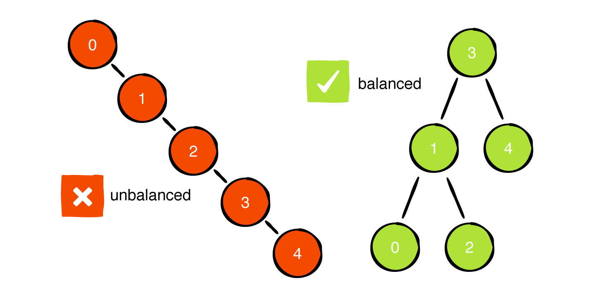
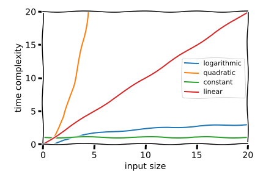
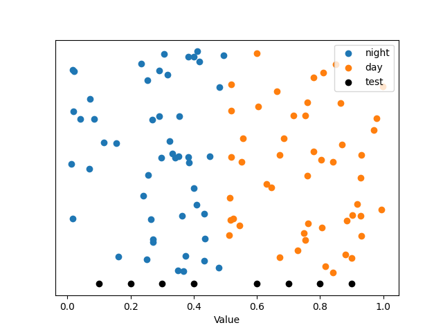
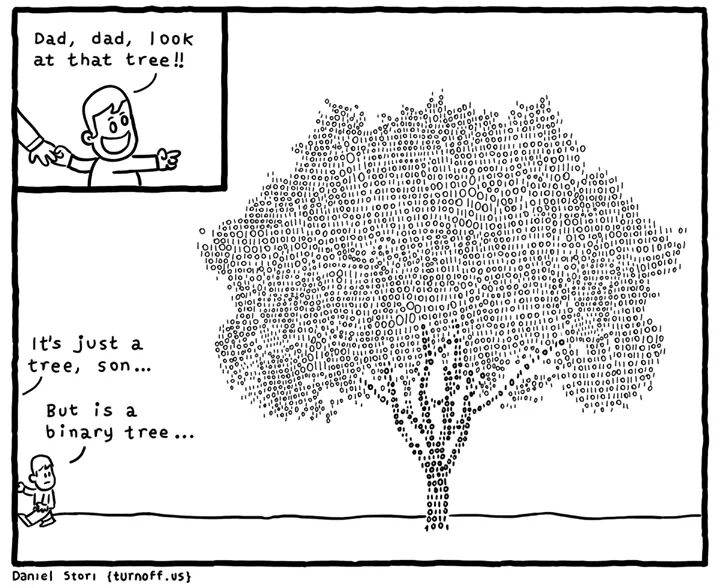
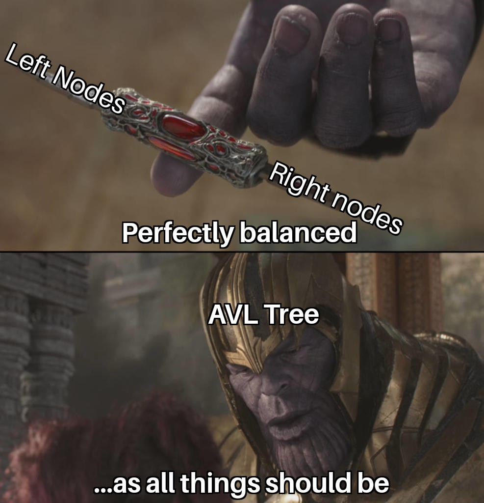
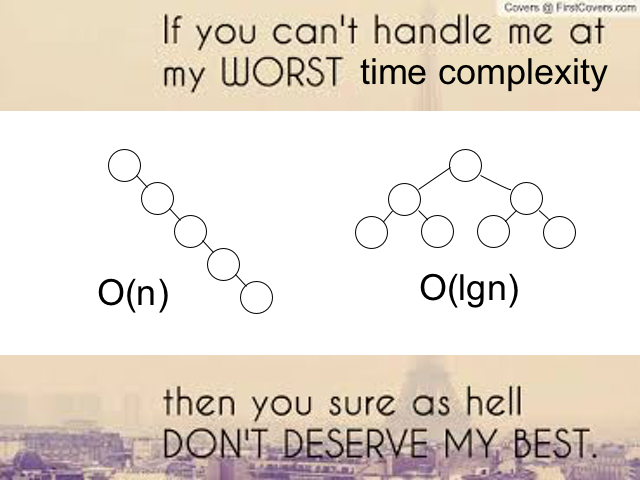

# Project 5: AVL Trees

**Due: Friday, March 12th @ 11:59p ET**

*This is not a team project. Do not copy someone else’s work.*

## Assignment Overview

[AVL trees](https://en.wikipedia.org/wiki/AVL_tree) are a self-balancing [binary search tree (BST)](https://en.wikipedia.org/wiki/Binary_search_tree) optimized to maintain logarithmic-time operations regardless of the order in which data is inserted and deleted. First introduced by Soviet computer scientists Georgy Adelson-Velsky and Evgenii Landis in their 1962 paper "[An algorithm for the organization of information](https://zhjwpku.com/assets/pdf/AED2-10-avl-paper.pdf)," AVL trees have stood the test of time and remain a popular choice when a space-efficient data structure supporting fast insertion/search/deletion is necessary.

To motivate AVL trees, it is worth considering a common problem that arises in traditional BSTs. BSTs are designed to perform logarithmic-time insertion/search/deletion, but may operate at linear-time if data is inserted or deleted according to certain patterns which cause the BST to become *unbalanced*. For example, when data is inserted into a traditional BST in sorted (or reverse-sorted) order, the BST will grow leaves in a single direction and effectively turn into a linked list. 

If our dataset is small, this may not be a problem—but when we're working with thousands or millions of records in a database, the difference between logarithmic and linear is astounding!

AVL trees improve upon traditional BSTs by *self-balancing* in order to guarantee logarithmic-time operations. In this project,
you will be implementing an AVL tree from scratch in Python and using it to solve a machine learning-inspired application problem.

## Assignment Notes

1. In this project, you'll be using Python `Generator` objects to traverse a tree in a space-efficient manner. Unlike a traversal returned in the form `List[Node]` using *O(n)* space, a traversal returning a generator will use *O(1)* space by *yielding* each `Node` in a sequential, on-demand manner. See [this link](https://realpython.com/introduction-to-python-generators/) for a nice introduction to `Generator`s in Python!

## Assignment Specifications

#### class Node:

*DO NOT MODIFY the following attributes/functions*

- **Attributes**
  - **value: T:** Value held by the `Node`. Note that this may be any type, such as a `str`, `int`, `float`, `dict`, or a more complex object.
  - **parent: Node:** Reference to this `Node`'s parent `Node` (may be `None`).
  - **left: Node:** Reference to this `Node`'s left child `Node` (may be `None`).
  - **right: Node:** Reference to this `Node`'s right child `Node` (may be `None`).
  - **height: int:** Number of levels of `Node`s below (the height of a leaf `Node` is 0).
  
- **\_\_init\_\_(self, value: T, parent: Node = None, left: Node = None, right: Node = None) -> None**
  - Constructs an AVL Tree node.
  - **value: T:** Value held by the `Node`.
  - **parent: Node:** Reference to this `Node`'s parent `Node` (may be `None`).
  - **left: Node:** Reference to this `Node`'s left child `Node` (may be `None`).
  - **right: Node:** Reference to this `Node`'s right child `Node` (may be `None`).
  - **Returns:** `None`.
  
- **\_\_str\_\_(self) -> str** and **\_\_repr\_\_(self) -> str**
  - Represents the `Node` as a string in the form `<value_held_by_node>`. Thus, `<7>` indicates a `Node` object holding an `int` value of 7, whereas `<None>` indicates a `Node` object holding a value of `None`. 
  - Note that Python will automatically invoke this function when using printing a `Node` to the console, and PyCharm will automatically invoke this function when displaying a `Node` in the debugger.
  - Call this with `str(node)` (rather than `node.__str__()`).
  - **Returns:** `str`.

#### class AVLTree:

*DO NOT MODIFY the following attributes/functions*

- **Attributes**
  - **origin: Node:** Root node of the entire `AVLTree` (may be `None`). This naming convention helps us disambiguate between when we are referring to the root of the entire `AVLTree` and the root of a subtree within the `AVLTree`. In fact, any given `Node` object within an `AVLTree` can be thought of as being the root of the subtree of all `Node`s below—and `origin` is the uppermost such root in our tree.
  - **size: int:** Number of nodes in the `AVLTree`.
  
- **\_\_init\_\_(self) -> None**
  - Construct an empty `AVLTree`. Initialize the `origin` to `None` and set the size to zero.
  - **Returns:** `None`.
  
- **\_\_str\_\_(self) -> str** and **\_\_repr\_\_(self) -> str**
  - Represents the `AVLTree` as a string in level-order form, with each `Node` displayed as `<value> (<value_of_parent>, height)` in the resulting string.
  - Note that Python will automatically invoke this function when using printing a `Node` to the console, and PyCharm will automatically invoke this function when displaying a `Node` in the debugger.
  - Call this with `str(node)` (rather than `node.__str__()`).
  - **Returns:** `str`.

- **height(self, root: Node) -> int**
  - Return height of a subtree in the AVL tree, properly handling the case of `root = None`. Recall that the height of an empty subtree is -1.
  - *Time / Space: O(log n) / O(1)*.
  - **root: Node:** The root `Node` of the subtree being measured.
  - **Returns:** Height of the subtree at `root`, i.e., the number of levels of `Node`s below this `Node`. The height of a leaf `Node` is 0, and the height of a `None`-type is -1.

- **left_rotate(self, root: Node) -> Node**
  - Perform a left rotation on the subtree rooted at `root`. Return root of new subtree after rotation.
  - *Time / Space: O(1) / O(1)*.
  - **root: Node:** The root `Node` of the subtree being rotated.
  - **Returns:** Root of new subtree after rotation.  
  
*IMPLEMENT the following functions*

- **right_rotate(self, root: Node) -> Node**
  - Perform a right rotation on the subtree rooted at `root`. Return root of new subtree after rotation.
  - This should be nearly identical to `left_rotate`, with only a few lines differing. Team 331 agreed that giving one rotation helps ease the burden of this project amidst break days and Exam 2—but writing the other rotation will be a good learning experience!
  - *Time / Space: O(1) / O(1)*.
  - **root: Node:** The root `Node` of the subtree being rotated.
  - **Returns:** Root of new subtree after rotation.  
  
- **balance_factor(self, root: Node) -> int**
  - Compute the balance factor of the subtree rooted at `root`.
  - Recall that the balance factor is defined to be `h_L - h_R` where `h_L` is the height of the left subtree beneath this `Node` and `h_R` is the height of the right subtree beneath this `Node`.
  - Note that in a properly-balanced AVL tree, the balance factor of all nodes in the tree will be in the set {-1, 0, +1}, as rebalancing will be triggered when a node's balance factor becomes -2 or +2.
  - The balance factor of an empty subtree (`None`-type `root`) is 0.
  - To stay within time complexity, keep the `height` attribute of each `Node` object updated on all insertions/deletions/rebalances, then use `h_L = left.height` and `h_R = right.height`.
  - *Time / Space: O(1) / O(1)*.
  - **root: Node:** The root `Node` of the subtree on which to compute the balance factor.
  - **Returns:** `int` representing the balance factor of `root`.  
  
- **rebalance(self, root: Node) -> Node**
  - Rebalance the subtree rooted at `root` (if necessary) and return the new root of the resulting subtree.
  - Recall that rebalancing is only necessary at this `root` if the balance factor `b` of this `root` satisfies `b >= 2 or b <= -2`.
  - Recall that there are [four types of imbalances possible in an AVL tree](https://en.wikipedia.org/wiki/AVL_tree#Rebalancing), and that each requires a different sequence of rotation(s) to be called.
  - *Time / Space: O(1) / O(1)*.
  - **root: Node:** The root `Node` of the subtree to be rebalanced.
  - **Returns:** Root of new subtree after rebalancing (could be the original root).    
  
- **insert(self, root: Node, val: T) -> Node**
  - Insert a node with `val` into the subtree rooted at `root`, returning the root node of the balanced subtree after insertion.
  - If `val` already exists in the AVL tree, do nothing. 
  - Should update `size` and `origin` attributes of `AVLTree` if necessary and correctly set parent/child pointers when inserting a new `Node`
  - Should update the `height` attribute and call `rebalance` on all `Node` objects affected by the insertion (ancestor nodes directly above on path to origin).
  - Easiest to implement recursively.
  - *Time / Space: O(log n) / O(1)*.
  - **root: Node:** The root `Node` of the subtree in which to insert `val`.
  - **val: T:** The value to be inserted in the subtree rooted at `root`.
  - **Returns:** Root of new subtree after insertion and rebalancing (could be the original root).  
  
- **min(self, root: Node) -> Node**
  - Find and return the `Node` with the smallest value in the subtree rooted at `root`.
  - Easiest to implement recursively.
  - *Time / Space: O(log n) / O(1)*.
  - **root: Node:** The root `Node` of the subtree in which to search for a minimum.
  - **Returns:** `Node` object containing the smallest value in the subtree rooted at `root`.  
  
- **max(self, root: Node) -> Node**
  - Find and return the `Node` with the largest value in the subtree rooted at `root`.
  - Easiest to implement recursively.
  - *Time / Space: O(log n) / O(1)*.
  - **root: Node:** The root `Node` of the subtree in which to search for a maximum.
  - **Returns:** `Node` object containing the largest value in the subtree rooted at `root`.  
  
- **search(self, root: Node, val: T) -> Node**
  - Find and return the `Node` with the value `val` in the subtree rooted at `root`.
  - If `val` does not exist in the subtree rooted at `root`, return the `Node` below which `val` would be inserted as a child. For example, on a balanced 1-2-3 tree (with 2 on top and 1, 3 as children), `search(node_2, 0)` would return `node_1` since the value of 0 would be inserted as a left child of `node_1`.
  - Easiest to implement recursively.
  - *Time / Space: O(log n) / O(1)*.
  - **root: Node:** The root `Node` of the subtree in which to search for `val`.
  - **val: T:** The value being searched in the subtree rooted at `root`.
  - **Returns:** `Node` object containing `val` if it exists, else the `Node` object below which `val` would be inserted as a child.
  
- **inorder(self, root: Node) -> Generator[Node, None, None]**
  - Perform an inorder (left, current, right) traversal of the subtree rooted at `root` using a [Python generator](https://realpython.com/introduction-to-python-generators/).
  - Use `yield` to immediately generate an element in your function, and `yield from` to generate an element from a recursive function call. 
  - Do not yield (generate) `None`-types.
  - *Time / Space: O(n) / O(1)*.
      - Although we will traverse the entire tree and hence incur O(n) time, our use of a generator will keep us at constant space complexity since elements are yielded one at a time! This is a key advantage of returning a generator instead of a list. 
  - **root: Node:** The root `Node` of the subtree currently being traversed.
  - **Returns:** `Generator` object which yields `Node` objects only (no `None`-type yields). Once all nodes of the tree have been yielded, a `StopIteration` exception is raised.
    
- **preorder(self, root: Node) -> Generator[Node, None, None]**
  - Perform a preorder (current, left, right) traversal of the subtree rooted at `root` using a [Python generator](https://realpython.com/introduction-to-python-generators/).
  - Use `yield` to immediately generate an element in your function, and `yield from` to generate an element from a recursive function call. 
  - Do not yield (generate) `None`-types.
  - *Time / Space: O(n) / O(1)*.
      - Although we will traverse the entire tree and hence incur O(n) time, our use of a generator will keep us at constant space complexity since elements are yielded one at a time! This is a key advantage of returning a generator instead of a list. 
  - **root: Node:** The root `Node` of the subtree currently being traversed.
  - **Returns:** `Generator` object which yields `Node` objects only (no `None`-type yields). Once all nodes of the tree have been yielded, a `StopIteration` exception is raised.    
  
- **postorder(self, root: Node) -> Generator[Node, None, None]**
  - Perform a postorder (left, right, current) traversal of the subtree rooted at `root` using a [Python generator](https://realpython.com/introduction-to-python-generators/).
  - Use `yield` to immediately generate an element in your function, and `yield from` to generate an element from a recursive function call. 
  - Do not yield (generate) `None`-types.
  - *Time / Space: O(n) / O(1)*.
      - Although we will traverse the entire tree and hence incur O(n) time, our use of a generator will keep us at constant space complexity since elements are yielded one at a time! This is a key advantage of returning a generator instead of a list. 
  - **root: Node:** The root `Node` of the subtree currently being traversed.
  - **Returns:** `Generator` object which yields `Node` objects only (no `None`-type yields). Once all nodes of the tree have been yielded, a `StopIteration` exception is raised.
  
- **levelorder(self, root: Node) -> Generator[Node, None, None]**
  - Perform a level-order (breadth-first) traversal of the subtree rooted at `root` using a [Python generator](https://realpython.com/introduction-to-python-generators/).
  - Use the builtin `queue.SimpleQueue` class to maintain your queue of children throughout the course of the traversal—[see the official documentation here.](https://docs.python.org/3/library/queue.html#queue.SimpleQueue) 
  - Use `yield` to immediately generate an element in your function, and `yield from` to generate an element from a recursive function call. 
  - Do not yield (generate) `None`-types.
  - *Time / Space: O(n) / O(n)*.
      - We will traverse the entire tree and incur O(n) time. In addition, the queue we must use for an inorder traversal will grow to size n/2 = O(n) just before beginning the final level of leaf nodes in the case of a [perfect binary tree.](https://www.programiz.com/dsa/perfect-binary-tree)
  - **root: Node:** The root `Node` of the subtree currently being traversed.
  - **Returns:** `Generator` object which yields `Node` objects only (no `None`-type yields). Once all nodes of the tree have been yielded, a `StopIteration` exception is raised.
  
- **remove(self, root: Node, val: T) -> Node**
  - Remove the node with value `val` from the subtree rooted at `root`, and return the root of the balanced subtree following removal.
  - If `val` does not exist in the AVL tree, do nothing. 
  - Should update `size` and `origin` attributes of `AVLTree` and correctly update parent/child pointers of `Node` objects as necessary.
  - Should update the `height` attribute and call `rebalance` on all `Node` objects affected by the removal (ancestor nodes directly above on path to origin).
  - Recall that there are [three distinct cases of BST removal to consider](https://en.wikipedia.org/wiki/Binary_search_tree#Deletion).
  - Easiest to implement recursively.
  - If the node being removed has two children, swap the value of this node with its **predecessor** and recursively remove this predecessor node (which contains the value to be removed after swapping and is guaranteed to be a leaf).
      - Although one technically *could* swap values with the successor node in a two-child removal, our testcases assume you will swap with the predecessor.
  - *Time / Space: O(log n) / O(1)*.
  - **root: Node:** The root `Node` of the subtree from which to delete `val`.
  - **val: T:** The value to be deleted from the subtree rooted at `root`.
  - **Returns:** Root of new subtree after removal and rebalancing (could be the original root).
  

## Application: *k*-Nearest Neighbors

Hey there, neighbor! You're interviewing to become a machine learning engineer at State Farm, and you've brought your A-game to every single question the lead ML engineer has thrown your way thus far. [She asks you what State Farm's favorite ML algorithm is, and you respond "*k*-Nearest Neighbors, of course!"](https://www.statefarm.com/about-us)

To seal the deal and land your dream job working alongside [Drake from State Farm](https://youtu.be/lvpq2OjmJvg), all you need to do is implement a one-dimensional [*k*-Nearest Neighbor](https://en.wikipedia.org/wiki/K-nearest_neighbors_algorithm) classifier. Using your knowledge of fast insertion/search/deletion data structures from CSE 331, you decide to use an AVL tree in the backend of your classifier and begin coding.

[Classification](https://en.wikipedia.org/wiki/Statistical_classification) refers to the task of categorizing data into one of several buckets. For example, the task of deciding whether an email is "spam" or "not spam" can be viewed as a classification problem. Traditionally, classification problems were solved by using conditional statements to create *rule-based* classifiers—but such rule-based classifiers are difficult to implement, maintain, and tune.

As such, [machine learning](https://en.wikipedia.org/wiki/Machine_learning) based classifiers have gained popularity. In contrast to rule-based classifiers, machine learning-based classifiers figure out how to classify new data on their own by learning the patterns embedded in previously-observed, labeled data.

A [*k*-Nearest Neighbor](https://en.wikipedia.org/wiki/K-nearest_neighbors_algorithm) classifier is one type of machine learning-based classifier that compares a new data point to its closest *neighbors* with known class labels. In this application problem, you'll be implementing two functions of a custom `NearestNeighborClassifier` class.

Given a *training* dataset of `(x, y)` pairs and *testing* dataset of `x` values, your `NearestNeighborClassifier` will:
1. `fit()` a one-dimensional *k*-Nearest Neighbor classifier to the *training* data, and
1. `predict()` the class labels of *testing* data based on the patterns observed in the *training* data.

More specifically, the training dataset will be a `List[tuple(float, str)]` of `(x: float, y: str)` tuples, where `x` can be thought of as a *feature* and `y` can be thought of as a *target label*. The goal of `fit()` is for the `NearestNeighborClassifier` to *learn* the associations between features `x` and target labels `y`, and the goal of `predict()` is for the `NearestNeighborClassifier` to predict the unknown labels of features `x`. 

For example, suppose we have a dataset of `(temperature, season)` pairs in which the `x: float` value is the daily high temperature on a scale of 0 to 1 and the `y: str` value indicates the season in which the temperature was recorded, with possible values `{"spring", "summer", "fall", "winter"}`. Then `fit()` will learn to associate lower temperatures with winter, higher temperatures with summer, and mid-range temperatures with spring and fall Likewise, `predict()` will take in a temperature `x` and output the most likely season `y` in which the temperature was observed.

The specifications below provide further detail.

- **fit(self, data: List[Tuple[float, str]]) -> None**
  - Fits the one-dimensional `NearestNeighborClassifier` to `data` by:
    - Rounding each `x` value to the number of digits specified by `self.resolution` to obtain a `key`,
    - Searching for the `Node` in `self.tree` with this `key`, which is guaranteed to exist by construction of `self.tree` in `self.__init__()`.
    - Accessing the `AVLWrappedDictionary` object stored in `node.value`, and
    - Updating the `dictionary` of this `node.value` by incrementing the number of times class `y` ended up at this node, i.e., the number of times class `y` was associated to `key`.
  - *Time / Space: O(n log n) / O(n)*
    - Searching for a node is *O(log n)* and must be completed *O(n)* times to save *O(n)* `dictionary` entries.
  - **data: List[Tuple[float, str]]:** A list of `(x: float, y: str)` pairs associating *feature* `x` values in the range `[0, 1]` to *target* `y` values. Provides the information necessary for our classifier to *learn*.
  - **Returns:** None.
  
- **predict(self, x: float, delta: float) -> str**
  - Predicts the class label of a single `x` value by:
    - Rounding `x` to the number of digits specified by `self.resolution` to obtain a `key`,
    - Searching for all `Node` objects in `self.tree` whose key is within `± delta` of this `key`,
    - Accessing the `AVLWrappedDictionary` object stored in all such `node.value`s, and
    - Taking the most common `y` label across all `dictionaries` stored in these `node.value`s.
  - Note that this process effectively predicts the class `y` based on the most common `y` observed in training data close to this `x`
  - If no data in `self.tree` from the training set has a key within `key ± delta`, return `None`.
  - *Time / Space: O(k log n) / O(1)*
    - Here, *k = (delta\*10\*\*resolution + 1)* is the number of neighbors being searched in `self.tree`, and each search is an *O(log n)* operation.
  - **x: float:** Feature value in range `[0, 1]` with unknown class to be predicted.
  - **delta: float:** Width of interval to search across for neighbors of `x`.   
  - **Returns:** `str` of the predicted class label `y`
  
To implement `fit()` and `predict()`, you'll need to understand how the `NearestNeighborClassifier` is constructed in its provided `__init__()` function. Additionally, you'll need to know how the `AVLWrappedDictionary` class works!

#### class NearestNeighborClassifier

*DO NOT MODIFY the following attributes/functions*

- **Attributes**
  - **tree: AVLTree:** Structure storing labeled training data, filled in `fit()` and used in `predict()`.
  - **resolution: int**: Number of decimal places to which feature `x` values are rounded.
  
- **\_\_init\_\_(self, resolution: int) -> None**
  - Initialize the `NearestNeighborClassifier` with `10**resolution + 1` nodes in `self.tree`, each storing a value of type `AVLWrappedDictionary`.
    - For example, if `resolution == 1`, then 11 nodes will be created with keys `0, 0.1, 0.2 ..., 1.0`, and if `resolution == 2`, then 101 nodes will be created with keys `0, 0.01, 0.02, ..., 1.0`.
  - **resolution: int:** Number of decimal places to which feature `x` values are rounded.
  - **Returns:** None.
- **\_\_str\_\_(self) -> str** and **\_\_repr\_\_(self) -> str**
  - Represents the `NearestNeighborClassifier` as a string.
  - **Returns:** `str`.
  
*IMPLEMENT the following functions*

- **fit(self, data: List[Tuple[float, str]]) -> None**
  - See above.
- **predict(self, x: float, delta: float) -> str**
  - See above.

#### class AVLWrappedDictionary:

*DO NOT MODIFY the following attributes/functions*

- **Attributes**
  - **key: float:** Floating point key which this `AVLWrappedDictionary` can be searched / looked up by.
  - **dictionary: dict** Price of a stock on a given date.
- **\_\_init\_\_(self, key: float) -> None**
  - Construct a `AVLWrappedDictionary`, a wrapper object which allows one to store dictionaries inside of a `Node` in an `AVLTree`, ordered and searchable by `key`.
  - **key: float:** Floating point key which this `AVLWrappedDictionary` can be searched / looked up by.
  - **Returns:** None.
- **\_\_str\_\_(self) -> str** and **\_\_repr\_\_(self) -> str**
  - Represents the `AVLWrappedDictionary` as a string.
  - **Returns:** `str`.
- **\_\_eq\_\_(self, other: AVLWrappedDictionary) -> bool**
- **\_\_gt\_\_(self, other: AVLWrappedDictionary) -> bool**
- **\_\_lt\_\_(self, other: AVLWrappedDictionary) -> bool**
  - Compare two `AVLWrappedDictionary`s to one another by `key`, returning the appropriate boolean value.
  - **other: AVLWrappedDictionary** Other object to compare to.
  - **Returns:** `bool` indicating whether this object is equal to, greater than, or less than `other`, respectively.

#### Example

Suppose we have a dataset of images, and wish to classify them by whether they were taken during the day or at night. We may directly measure the brightness `x` of each image on a scale of `[0, 1]`, and it stands to reason that  `x` may be a useful predictor of the class label `y` from `{"day", "night"}`, since bright images are more likely to be taken during the day and vice-versa for dark images.

Given the labeled dataset

    data = [(0.18, "night"), (0.21, "night"), (0.29, "night"),
            (0.49, "night"), (0.51, "day"), (0.53, "day"),
            (0.97, "day"), (0.98, "day"), (0.99, "day")]

with a `NearestNeighborClassifier` whose `resolution` is 1, the `tree` of our classifier would look as follows after a call to `fit(data)`:

    NNC(resolution=1):
                                    AVL Tree: size = 11, height = 3                                 
    Level 0:                                  <key: 0.3, dict: {'night': 1}>                                 
    Level 1:               <key: 0.1, dict: {}>                            <key: 0.7, dict: {}>              
    Level 2:   <key: 0.0, dict: {}>  <key: 0.2, dict: {'night': 2}><key: 0.5, dict: {'night': 1, 'day': 2}>  <key: 0.9, dict: {}>  
    Level 3:                                                 <key: 0.4, dict: {}><key: 0.6, dict: {}><key: 0.8, dict: {}><key: 1.0, dict: {'day': 3}>

Now, suppose we are given the following brightness observations from unlabeled images 

    test_images = [0.1, 0.2, 0.5, 0.8, 0.9]

and asked to predict the class label `y` from `{"day", "night"}` for each `x in test_images` with `delta = 0.1`. Then:
- `predict(x=0.1, delta=0.1)` would look at the total number of `"day"` and `"night"` instances in the nodes with keys `{0, 0.1, 0.2}`, finding 2 `"night"` instances and 0 `"day"` instances. Thus, `"night"` would be predicted.  
- `predict(x=0.2, delta=0.1)` would look at the total number of `"day"` and `"night"` instances in the nodes with keys `{0.1, 0.2, 0.3}`, finding 3 `"night"` instances and 0 `"day"` instances. Thus, `"night"` would be predicted.  
- `predict(x=0.5, delta=0.1)` would look at the total number of `"day"` and `"night"` instances in the nodes with keys `{0.4, 0.5, 0.6}`, finding 1 `"night"` instance and 2 `"day"` instances. Thus, `"day"` would be predicted.  
- `predict(x=0.8, delta=0.1)` would look at the total number of `"day"` and `"night"` instances in the nodes with keys `{0.7, 0.8, 0.9}`, finding 0 `"night"` instance and 0 `"day"` instances. Thus, `None` would be predicted.  
- `predict(x=0.9, delta=0.1)` would look at the total number of `"day"` and `"night"` instances in the nodes with keys `{0.8, 0.9, 1}`, finding 0 `"night"` instance and 3 `"day"` instances. Thus, `"day"` would be predicted.  

To summarize, the following code

    nnc = NearestNeighborClassifier(resolution=1)
    nnc.fit(data)
    predictions = nnc.predict(test_images)

would give

    predictions = ["night", "night", "day", None, "day"]

More cases and precise input/output syntax are provided in the testcases. 

Note that the testcases include a `plot` flag variable to enable (optional) visualization of the training and testing data using `numpy` and `matplotlib`. An example plot visualizing the training and testing data for test 1b is shown below.

## Submission

#### Deliverables

Be sure to upload the following deliverables in a .zip folder to Mimir by 11:59p ET on Friday, March 12th.

    Project5.zip
        |— Project5/
            |— README.xml      (for project feedback)
            |— __init__.py     (for proper Mimir testcase loading)
            |— AVLTree.py      (contains your solution source code)

#### Grading

- Tests (75)
  - Coding Standard: \_\_/5
  - `AVLTree`: \_\_/54
    - `right_rotate`: \_\_/1
    - `balance_factor`: \_\_/1
    - `rebalance`: \_\_/8
    - `insert`: \_\_/8
    - `min`: \_\_/2
    - `max`: \_\_/2
    - `search`: \_\_/8
    - `inorder`: \_\_/2
    - `preorder`: \_\_/2
    - `postorder`: \_\_/2
    - `levelorder`: \_\_/2
    - `remove`: \_\_/8
    - `avl_comprehensive`: \_\_/8
  - `NearestNeighborClassifier`: \_\_/16
    - `nnc_basic`: \_\_/8
    - `nnc_comprehensive`: \_\_/8
- Manual (25)
  - `README.xml` is completely filled out with (1) Name, (2) Feedback, (3) Time to Completion and (4) Citations: \_\_/5
  - `AVLTree` time & space: \_\_/16
    - `right_rotate`: \_\_/1
    - `balance_factor`: \_\_/1
    - `rebalance`: \_\_/2
    - `insert`: \_\_/2
    - `min`: \_\_/1
    - `max`: \_\_/1
    - `search`: \_\_/2
    - `inorder`: \_\_/1
    - `preorder`: \_\_/1
    - `postorder`: \_\_/1
    - `levelorder`: \_\_/1
    - `remove`: \_\_/2
  - `NearestNeighborClassifier`: \_\_/4
    - `fit`: \_\_/2
    - `predict`: \_\_/2
      
## Appendix

#### Authors

Project authored by Andrew McDonald and Bank Premsri.

#### Memes

